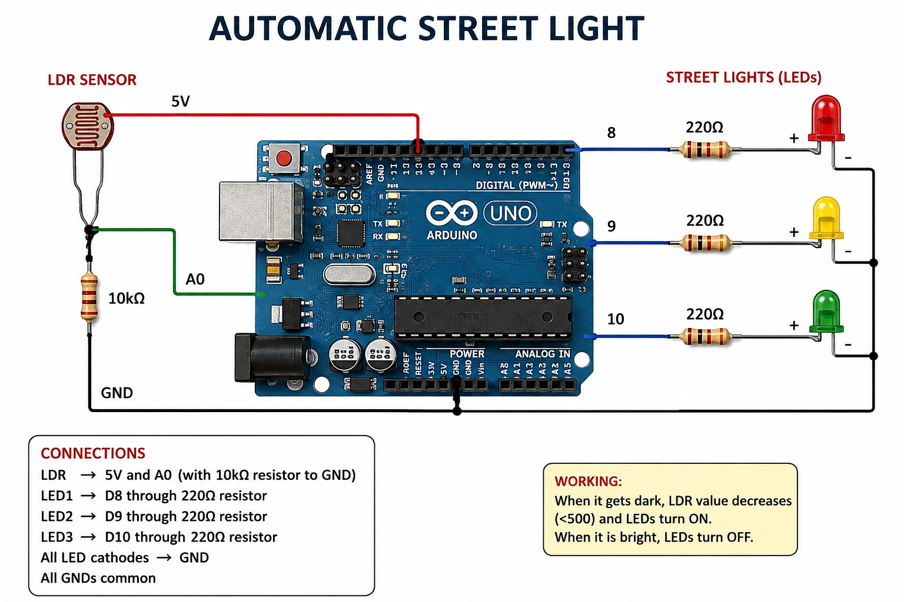

# Automatic Street Light using Arduino

## Project Overview

The Automatic Street Light is an Arduino-based project that automatically turns the street lights ON in darkness and OFF in bright light.

An LDR (Light Dependent Resistor) is used to detect the surrounding light intensity. Arduino reads the LDR value and controls three LEDs.

## Components Required

- Arduino Uno
- LDR Sensor
- 10kΩ Resistor
- 3 LEDs
- 3 × 220Ω Resistors
- Breadboard
- Jumper Wires

## Pin Connections

| Component | Arduino Pin |
|-----------|-------------|
| LDR | A0 |
| LED 1 | D8 |
| LED 2 | D9 |
| LED 3 | D10 |

## LDR Connection

- LDR → 5V and A0
- 10kΩ resistor → A0 and GND

## LED Connections

- LED 1 → D8 through 220Ω resistor
- LED 2 → D9 through 220Ω resistor
- LED 3 → D10 through 220Ω resistor
- All LED cathodes → GND

## Working

1. The LDR detects the surrounding light.
2. Arduino reads the LDR value through A0.
3. When it becomes dark, the LDR value goes below the threshold.
4. Arduino turns ON all three LEDs.
5. When it becomes bright, Arduino turns OFF all three LEDs.

## Logic

Darkness → LEDs ON

Bright Light → LEDs OFF

## Software Used

- VS Code
- Arduino
- C/C++

## Project Structure

Automatic-Street-Light/

├── automatic_street_light.ino
├── circuit_diagram.png
└── README.md

## Circuit Diagram

## Applications

- Automatic street lighting
- Smart city lighting
- Energy-saving lighting systems
- Road and pathway lighting
- Outdoor lighting automation

## Future Improvements

- Add PIR sensor for motion detection
- Add PWM for brightness control
- Add solar power
- Add IoT-based monitoring
